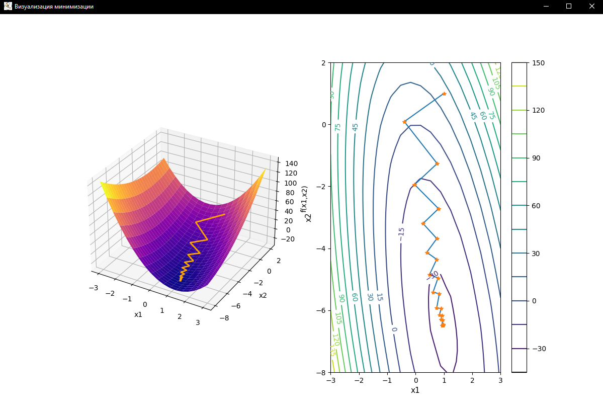
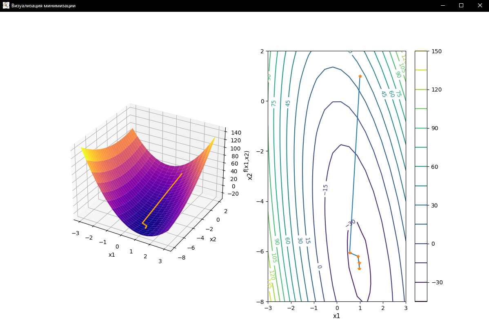

# Implementations of various optimization methods

## Structure

1. **simplex.py** - Simplex method
2. **graddesc.py** - Gradient descenent with minimum step
3. **neuton_raph.py** - Neuton Raphson

## Screenshots

